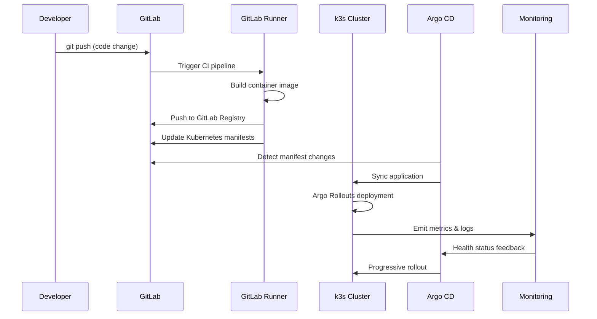

# Self-Hosted CI/CD + GitOps Platform for Home Lab

## 📋 Project Overview

A complete, production-inspired CI/CD and GitOps platform designed specifically for resource-constrained environments. This project demonstrates enterprise-grade DevOps practices using lightweight tools that can run efficiently within a 15GB RAM home lab environment on a **single-node Ubuntu server**.

## 🎯 Project Goal

Build a complete, self-hosted CI/CD + GitOps system using resource-efficient tools that simulate real production workflows while staying fully achievable within a **15GB RAM single-node Ubuntu server**.

## 🏗️ Architecture (Single-Node Optimized)

### System Architecture Diagram

```mermaid
flowchart TD
    %% ========== SINGLE NODE UBUNTU HOST ==========
    subgraph UBUNTU_HOST[Ubuntu 22.04 LTS Host - 15GB RAM Total]
        direction TB
        
        %% ========== HOST OPERATING SYSTEM ==========
        subgraph HOST_OS[Host Operating System - 1.5GB RAM]
            direction TB
            OS_KERNEL[Linux Kernel 5.15+<br/>Container Support]
            OS_NET[Network Stack<br/>iptables/CNI]
            OS_STORAGE[Storage Layer<br/>ext4/XFS]
            OS_SERVICES[Systemd Services<br/>Docker, k3s, GitLab]
            
            OS_KERNEL --> OS_NET
            OS_KERNEL --> OS_STORAGE
            OS_KERNEL --> OS_SERVICES
        end

        %% ========== GITLAB PLATFORM ==========
        subgraph GITLAB_PLAT[GitLab CE Platform - 4.5GB RAM]
            direction TB
            
            subgraph GL_WEB[Web Frontend - 2.0GB]
                GL_PUMA[Puma Server<br/>2 Workers]
                GL_RAILS[Ruby on Rails<br/>Application]
                GL_UI[Web UI<br/>Repository Management]
                
                GL_PUMA --> GL_RAILS --> GL_UI
            end
            
            subgraph GL_SERVICES[Background Services - 2.0GB]
                GL_SIDEKIQ[Sidekiq<br/>5 Workers]
                GL_POSTGRES[(PostgreSQL<br/>64MB shared buffers)]
                GL_REDIS[(Redis<br/>Cache & Sessions)]
                GL_REGISTRY[Container Registry<br/>Docker Storage]
                
                GL_SIDEKIQ --> GL_POSTGRES
                GL_SIDEKIQ --> GL_REDIS
                GL_RAILS --> GL_REGISTRY
            end
            
            subgraph GL_CI_CD[CI/CD Components - 0.5GB]
                GL_RUNNER[GitLab Runner<br/>Docker Executor]
                GL_PIPELINES[Pipeline Scheduler]
                GL_ARTIFACTS[Artifact Storage]
                
                GL_RUNNER --> GL_PIPELINES --> GL_ARTIFACTS
            end
            
            GL_WEB --> GL_SERVICES
            GL_SERVICES --> GL_CI_CD
        end

        %% ========== K3S SINGLE NODE CLUSTER ==========
        subgraph K3S_CLUSTER[k3s Kubernetes Cluster - 6.0GB RAM]
            direction TB
            
            %% CONTROL PLANE
            subgraph K3S_CP[k3s Control Plane - 1.0GB]
                K3S_API[k3s Server<br/>Kubernetes API]
                K3S_ETCD[Embedded etcd<br/>Key-Value Store]
                K3S_CTRL[Controller Manager]
                K3S_SCHED[Scheduler]
                K3S_FLANNEL[Flannel CNI<br/>Network Plugin]
                
                K3S_API --> K3S_ETCD
                K3S_API --> K3S_CTRL
                K3S_API --> K3S_SCHED
                K3S_API --> K3S_FLANNEL
            end
            
            %% CONTAINER RUNTIME
            subgraph CONTAINER_RT[Container Runtime - 0.5GB]
                CONTAINERD[containerd<br/>Container Runtime]
                RUNC[runc<br/>OCI Runtime]
                CTR_CTL[ctr<br/>Container Management]
                
                CONTAINERD --> RUNC --> CTR_CTL
            end
            
            %% GITOPS STACK
            subgraph GITOPS_STACK[GitOps Stack - 0.5GB]
                ARGO_CD[Argo CD Server<br/>GitOps Controller]
                ARGO_ROLLOUTS[Argo Rollouts<br/>Progressive Delivery]
                ARGO_APPS[Application Controller<br/>Sync Logic]
                ROLLOUT_CRD[Rollout CRD<br/>Custom Resources]
                
                ARGO_CD --> ARGO_APPS
                ARGO_CD --> ARGO_ROLLOUTS
                ARGO_ROLLOUTS --> ROLLOUT_CRD
            end
            
            %% MONITORING STACK
            subgraph MONITORING[Monitoring Stack - 1.5GB]
                subgraph METRICS[Metrics Collection - 1.0GB]
                    PROMETHEUS[Prometheus Server<br/>Time Series DB]
                    NODE_EXPORTER[Node Exporter<br/>Host Metrics]
                    KUBE_STATE_METRICS[Kube State Metrics<br/>K8s Objects]
                    PROM_OPERATOR[Prometheus Operator<br/>CRD Management]
                    
                    PROMETHEUS --> NODE_EXPORTER
                    PROMETHEUS --> KUBE_STATE_METRICS
                    PROM_OPERATOR --> PROMETHEUS
                end
                
                subgraph LOGGING[Logging System - 0.3GB]
                    LOKI[Loki<br/>Log Aggregation]
                    PROMTAIL[Promtail<br/>Log Collector]
                    LOKI_API[Loki API<br/>Query Interface]
                    
                    PROMTAIL --> LOKI --> LOKI_API
                end
                
                subgraph VIZ[Visualization - 0.2GB]
                    GRAFANA[Grafana<br/>Dashboards]
                    GRAFANA_DS[Grafana Data Sources]
                    
                    GRAFANA --> GRAFANA_DS
                end
                
                METRICS --> VIZ
                LOGGING --> VIZ
            end
            
            %% APPLICATION WORKLOADS
            subgraph APPLICATIONS[Application Workloads - 2.5GB]
                subgraph SAMPLE_APP[Sample FastAPI Application - 1.0GB]
                    APP_V1[FastAPI v1.0.0<br/>Stable Deployment]
                    APP_V2[FastAPI v1.1.0<br/>Canary Deployment]
                    APP_SERVICE[Kubernetes Service<br/>Load Balancing]
                    APP_INGRESS[Ingress Controller<br/>Traffic Routing]
                    
                    APP_SERVICE --> APP_V1
                    APP_SERVICE --> APP_V2
                    APP_INGRESS --> APP_SERVICE
                end
                
                subgraph SYSTEM_APPS[System Applications - 1.5GB]
                    TRAEFIK[Traefik Ingress<br/>Reverse Proxy]
                    LOCAL_PATH[Local Path Provisioner<br/>Storage]
                    METRICS_SVC[Metrics Services<br/>Monitoring Agents]
                    NETWORK_POL[Network Policies<br/>Security]
                    
                    TRAEFIK --> APP_INGRESS
                    LOCAL_PATH --> APP_V1
                    LOCAL_PATH --> APP_V2
                end
            end
            
            K3S_CP --> CONTAINER_RT
            CONTAINER_RT --> GITOPS_STACK
            CONTAINER_RT --> MONITORING
            CONTAINER_RT --> APPLICATIONS
            GITOPS_STACK --> APPLICATIONS
        end

        %% ========== SAFETY BUFFER ==========
        subgraph BUFFER[Safety Buffer - 3.0GB RAM]
            direction TB
            MEM_BUFFER[Memory Headroom<br/>Peak Loads]
            CPU_BUFFER[CPU Reserve<br/>Background Tasks]
            IO_BUFFER[I/O Buffer<br/>Disk & Network]
            
            MEM_BUFFER --> CPU_BUFFER --> IO_BUFFER
        end
    end

    %% ========== EXTERNAL INTERACTIONS ==========
    subgraph EXTERNAL[External Interactions]
        direction TB
        DEVELOPER[Developer<br/>git push / Web UI]
        END_USER[End User<br/>Application Access]
        MONITOR_USER[Monitoring User<br/>Grafana Dashboards]
        
        DEVELOPER --> GITLAB_PLAT
        END_USER --> APPLICATIONS
        MONITOR_USER --> MONITORING
    end

    %% ========== DATA FLOW CONNECTIONS ==========
    %% Developer to GitLab
    DEVELOPER --> GL_UI
    DEVELOPER --> GL_PIPELINES
    
    %% GitLab to k3s
    GL_RUNNER --> CONTAINER_RT
    GL_REGISTRY --> APP_V1
    GL_REGISTRY --> APP_V2
    
    %% GitLab to GitOps
    GL_UI --> ARGO_CD
    
    %% GitOps to Applications
    ARGO_ROLLOUTS --> APP_V1
    ARGO_ROLLOUTS --> APP_V2
    ARGO_ROLLOUTS --> APP_SERVICE
    
    %% Monitoring Connections
    APP_V1 --> PROMETHEUS
    APP_V2 --> PROMETHEUS
    APP_V1 --> PROMTAIL
    APP_V2 --> PROMTAIL
    NODE_EXPORTER --> HOST_OS
    
    %% Rollout Decision Flow
    PROMETHEUS --> ARGO_ROLLOUTS
    GRAFANA --> ARGO_ROLLOUTS

    %% ========== STYLING ==========
    classDef host fill:#e3f2fd,stroke:#1976d2,stroke-width:3px
    classDef os fill:#fff3e0,stroke:#f57c00,stroke-width:2px
    classDef gitlab fill:#fce4ec,stroke:#c2185b,stroke-width:2px
    classDef k8s fill:#e8f5e8,stroke:#388e3c,stroke-width:2px
    classDef controlplane fill:#c8e6c9,stroke:#2e7d32,stroke-width:2px
    classDef gitops fill:#e0f2f1,stroke:#00695c,stroke-width:2px
    classDef monitoring fill:#fff8e1,stroke:#ffa000,stroke-width:2px
    classDef applications fill:#f3e5f5,stroke:#7b1fa2,stroke-width:2px
    classDef buffer fill:#ffebee,stroke:#d32f2f,stroke-width:2px
    classDef external fill:#e1f5fe,stroke:#0288d1,stroke-width:2px

    class UBUNTU_HOST host
    class HOST_OS os
    class GITLAB_PLAT gitlab
    class K3S_CLUSTER k8s
    class K3S_CP controlplane
    class GITOPS_STACK gitops
    class MONITORING monitoring
    class APPLICATIONS applications
    class BUFFER buffer
    class EXTERNAL external
```



### Single-Node Resource Allocation

| Component | RAM Allocation | Notes |
|-----------|----------------|-------|
| **Ubuntu OS** | 1.5 GB | Base operating system |
| **GitLab CE** | 4.0 GB | Lightweight configuration |
| **K3s Control Plane** | 1.0 GB | Single-node k3s cluster |
| **Applications** | 2.0 GB | Sample apps + system workloads |
| **Monitoring Stack** | 1.5 GB | Prometheus, Grafana, Loki |
| **GitOps Tools** | 0.5 GB | Argo CD + Rollouts |
| **GitLab Runner** | 0.3 GB | Single Docker executor |
| **Container Registry** | 0.2 GB | GitLab integrated registry |
| **Safety Buffer** | 3.0 GB | Headroom for spikes |
| **TOTAL** | **15.0 GB** | Optimized for single-node |

### Tool Selection Rationale (Single-Node Optimized)

- **k3s**: Lightweight Kubernetes, perfect for single-node deployments
- **Argo Rollouts**: Minimal footprint for progressive delivery (no Istio complexity)
- **GitLab CE**: All-in-one solution with built-in CI/CD and registry
- **Loki**: Lightweight log aggregation (vs heavy ELK stack)
- **Single-Node**: Eliminates VM overhead, maximizes resource utilization

## 🛠️ Technical Stack (Single-Node Optimized)

### Core Components
- **Operating System**: Ubuntu 22.04 LTS
- **Version Control & CI/CD**: GitLab CE (lightweight configuration)
- **Container Orchestration**: k3s single-node cluster
- **GitOps**: Argo CD
- **Progressive Delivery**: Argo Rollouts
- **Monitoring**: Prometheus + Grafana
- **Logging**: Loki + Promtail
- **Container Registry**: GitLab Container Registry
- **Sample Application**: FastAPI microservice

## 📁 Project Structure

```
self-hosted-cicd-gitops/
├── infrastructure/
│   ├── k3s-single-node/
│   ├── gitlab-bare-metal/
│   └── monitoring/
├── applications/
│   ├── sample-fastapi-app/
│   └── gitops-configs/
├── gitlab-ci/
│   └── templates/
├── scripts/
│   ├── setup-k3s.sh
│   ├── setup-gitlab.sh
│   └── setup-monitoring.sh
└── docs/
    ├── architecture.md
    └── setup-guide.md
```

## 🚀 Implementation Stages (Single-Node)

### Stage 1 — Architecture & Environment Setup ✅
- Single-node architecture design
- Ubuntu host preparation and optimization
- Resource allocation planning
- Network configuration (simplified - localhost)
- Storage planning (local paths)

### Stage 2 — GitLab CE (Lightweight Mode)
- Bare metal GitLab installation on Ubuntu
- Minimal memory configuration
- Disable non-essential components
- Integrated container registry setup
- Project and repository creation

### Stage 3 — k3s Single-Node Cluster
- k3s installation (single-node mode)
- Container runtime configuration
- Local path provisioner setup
- Network policies (simplified)
- Integration with host GitLab

### Stage 4 — GitLab Runner Setup
- Runner installation on host OS
- Docker executor configuration
- Registration with GitLab
- Resource limits and optimization
- Test pipeline execution

### Stage 5 — Application Code + Dockerfile
- Lightweight FastAPI microservice
- Optimized multi-stage Dockerfile
- Unit tests and health checks
- Application configuration

### Stage 6 — Full GitLab CI Pipeline
- `.gitlab-ci.yml` with single-node optimizations
- Pipeline stages: build → test → scan → publish → deploy
- Security scanning with Trivy
- Automated manifest updates
- Single-node specific optimizations

### Stage 7 — GitOps Deployment with Argo CD + Rollouts
- Argo CD installation on k3s
- GitOps repository structure
- Argo Rollouts for blue-green deployments
- Application deployment and synchronization
- End-to-end workflow validation

## 🔄 Single-Node Workflow Overview



## 🎯 Key Features (Single-Node Optimized)

### CI/CD Pipeline
- **Multi-stage pipelines**: build, test, security scan, publish, deploy
- **Security scanning**: Container vulnerability scanning with Trivy
- **Automated deployments**: GitOps-driven continuous deployment
- **Single-node optimizations**: Reduced parallelism, optimized resource usage

### GitOps Implementation
- **Declarative configuration**: Everything-as-Code
- **Automated synchronization**: Self-healing deployments
- **Single-cluster management**: Simplified environment strategy
- **Rollback capability**: Instant recovery from failed deployments

### Progressive Delivery
- **Blue-Green deployments**: Zero-downtime releases on single node
- **Canary releases**: Gradual traffic shifting within single node
- **Automated rollbacks**: Based on metrics and health checks
- **Traffic management**: Service-based routing within cluster

### Monitoring & Observability
- **Metrics collection**: Prometheus for application and system metrics
- **Log aggregation**: Loki for centralized logging
- **Dashboarding**: Grafana for visualization
- **Single-node monitoring**: Host and container metrics combined

## 📊 Single-Node Resource Optimization

### Memory-Efficient Configuration
- **GitLab**: Reduced worker processes, disabled non-essential features
- **k3s**: Single-node mode, minimal control plane footprint
- **Monitoring**: Reduced metric retention, optimized scraping
- **Applications**: Conservative resource limits and requests

### Performance Optimizations
- **Shared resources**: No VM overhead, direct hardware access
- **Optimized storage**: Local path provisioner for volumes
- **Network efficiency**: Localhost communication, no overlay network overhead
- **Container optimization**: Multi-stage builds, minimal base images

## 🚀 Getting Started

### Prerequisites
- Ubuntu 22.04 LTS server with 15GB RAM
- 50GB+ free disk space
- Docker installed
- Basic Linux administration knowledge

### Quick Start
```bash
# Clone the repository
git clone https://github.com/your-username/self-hosted-cicd-gitops.git

# Review single-node architecture
cd self-hosted-cicd-gitops/docs/

# Follow stage-by-stage implementation
./scripts/setup-k3s.sh
./scripts/setup-gitlab.sh
```

## 🛠️ Single-Node Advantages

### Benefits of Single-Node Approach
- **Maximized Resources**: No VM overhead, 100% resource utilization
- **Simplified Networking**: Localhost communication, no complex networking
- **Easier Troubleshooting**: Single system to monitor and debug
- **Reduced Complexity**: No multi-node coordination required
- **Faster Deployment**: Direct host access, no virtualization layers

### Production Relevance
Despite being single-node, this setup teaches:
- **Real GitOps workflows** with Argo CD
- **Production deployment strategies** with Argo Rollouts
- **Enterprise CI/CD patterns** with GitLab
- **Monitoring and observability** practices
- **Security scanning** and quality gates

## 📚 Documentation

Each implementation stage includes single-node specific:
- Detailed setup instructions for bare metal
- Performance tuning recommendations
- Resource optimization guides
- Troubleshooting for single-node issues

## 🤝 Contributing

This project demonstrates real DevOps practices in resource-constrained environments. Contributions, issues, and single-node optimization suggestions are welcome!

## 📄 License

This project is licensed under the MIT License - see the LICENSE file for details.

---

**Note**: This single-node configuration is specifically optimized for learning and home lab environments. While it demonstrates production patterns, enterprise production deployments typically use multi-node clusters for high availability.
